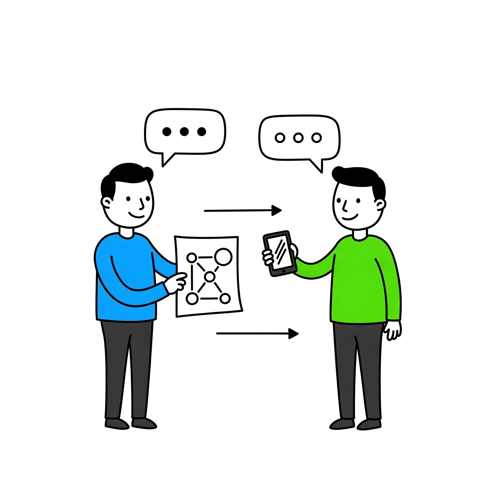

# Networks in IOT -- An Overview

Recently, I have been working with projects using IOT devices. Automating a solar system, or automatically fill a water tank when it’s low — These are some of the problems that nowadays are tied to the _Internet of Things_ field.

The problem is [communication](https://en.wikipedia.org/wiki/Communication_protocol) between devices can be a bit cryptic, with some unknown terms lodged in devices and practices, that if you don’t know what they mean, you’re lost.

In this article, the idea is to try to decrypt a bit some of those terms related to communication protocols, a subject that I think is crucial to understand in IOT, since a lot of devices have different purposes and design; not everything is tied to the internet protocol, as it happens usually with computers and cellphone applications.

Hopefully, we should be able to answer some questions such as:

*   What is a communication protocol?
*   What protocols are used by IOT for communication?
*   How can an IOT device communicate with another IOT device, or a more complex device like a cellphone?

### Communication protocols

Communication protocols are basic rules set to determine how two devices can exchange data. With automation, in many ways the final goal is to determine what to do given some information we have.

A helpful analogy, is to use the protocols related to the internet, in this case we’re going to come across the [OSI pattern](https://en.wikipedia.org/wiki/OSI_model).

The OSI pattern is a model in which the communication of data is divided into 7 layers, from physical to application. One of the core ideas of the model is that layers should have a specific responsibility (what to do) and that layers should be replaceable by different protocols, and other layers remain unaffected. For example with the internet, at the application level we have many different protocols, all of which use the transport and network layer of TCP/IP: HTTP, FTP, MQTT, WebSocket, etc.

Nowadays with the internet and other network patterns, the OSI model is not used for applications, however its still a helpful analogy.

The layers for the OSI model are:

*   **Physical layer**: First layer, interface to transmit the signal. For example Bluetooth, wi-fi, [LoRa](https://pt.wikipedia.org/wiki/LoRa), [li-fi](https://en.wikipedia.org/wiki/Li-Fi), infrared (irda), etc. These are part of the physical layer, and a lot of times, depending on how someone may define it, the physical and data link layer will be mixed.
*   **Data link layer**: Interface with the physical layer, this layer sits between the receiver/transmitter on the devices, responsible mainly for parsing the signal and error correction. For example LLC+ MAC, PPP (old dial-up internet), [SPI](https://en.wikipedia.org/wiki/Serial_Peripheral_Interface) (used in many IOT chips), 4G, etc.
*   **Network layer**: Responsible for passing information between nodes of a network. In the internet example, we have IP at this level.
*   **Transport layer**: At this layer, we start to have a distinction between applications running in a same node. For example at this level we have the TCP and UDP protocols.
*   **Session + Presentation + Application layers**: Usually, these layers are joined together (for example, in the internet definition), they represent the final layers, how information that is being passed is accepted and processed. At this level, we have HTTP, MQTT, DNS, etc

Note that in some sensor usage examples, since the devices are much simpler, sometimes you may have a great simplification of the protocol steps, or the OSI pattern might not make much sense, since the idea of the pattern is to represent _computer networks._

For example, if you’re using a thermal sensor, along with a microcontroller that reads and displays temperature information in a LED screen, we could have:

*   Physical and data link layers are the wires + SPI connector interface,
*   network, if we could say there’s any, is between the master and slave architecture. There are only two nodes in this example, the sensor and the microcontroller
*   There’s no transport layer, given there’s only one application running on the device. Perhaps we could attribute some of the underlying libraries and utilities used to read input and output on the microcontroller to this layer, but it’s not very similar to the OSI model
*   The final layers are extremely simplified, depending on how the input and output pins of the microcontroller are used.

### IOT

IOT, defined as internet of things, is usually thought as devices such as sensors connected through the internet. This is limited, though, since we can have networks that are not connected through the internet, such as [LoRaWAN](https://en.wikipedia.org/wiki/LoRa#LoRaWAN), or some automation situations where a network is not necessary or wanted (such as with local wire and wireless connections). With this, IOT should instead be considered as devices connected through a network, which can be designed in many different ways, with different types of layers.

Establishing what to use in a project will depend on some of the needed characteristics of the project, for example:

*   Do we need wireless communication between devices?
*   What is the required range?
*   Do we want to have control through our cellphone or PC, with a user interface? Or some simpler device?
*   What type of signal are we sending? A simple boolean or more complex data?
*   Do we need to read data from the device?
*   How are we going to read this data? Do we need to have persistence, that is, the data needs to be stored?
*   Do we have multiple devices? How are they being used?

Answering some of these questions will point what are the requisites of the project, and thus direct us on what communication protocol can be used. Let’s analyze two examples:

### 1 — Water level automation

The idea is to automate the filling of a water tank. For this project, we’ll want:

*   A water tank + a sensor that will read the water level.
*   If the level is below a threshold, the sensor will activate a relay and the pump will be automatically turned on. It will turn off once the water reaches a certain level
*   We’ll also want to read the water level from our cellphone, and be able to turn the pump on or off using the cellphone. We can do this while within wifi range of the local network.

In this case, we want medium-range wireless communication, a simple interface on the cellphone which can be limited to the local area network as well as communication of the sensor data through the network.

An implementation could look like this:

*   We can work with a microcontroller that has a wi-fi receiver and transmitter, with the microcontroller working on the local network (with a fixed IP or [mDNS](https://en.wikipedia.org/wiki/Multicast_DNS) to keep its address fixed) as a simple HTTP web server. If you want to know more, check how [DHCP works](https://en.wikipedia.org/wiki/Dynamic_Host_Configuration_Protocol)
*   As a web server, the microcontroller would serve locally information about its water level, as well as being able to receive a request to manually trigger the pump. State could be kept at the memory level

### 2 — Pump activation for crop watering

For this project, we’ll want

*   A controller that will turn on a water sprinkler to water a crop ,given user input from their cellphone or PC
*   We’ll want to read soil humidity from the crop, and send this information to be accessed from an application on the cellphone or PC
*   The user can turn on and read data from the system anywhere he may have an internet connection

In this situation, we have a similar setup regarding to the data that the IOT device needs to send and receive; however, the range in which the activation needs to be done is different.

*   Similarly, we can work with a microcontroller that has wi-fi connection, but we’ll need access to the broader internet. We could perform some [port forwarding](https://en.wikipedia.org/wiki/Port_forwarding), along with getting a static IP to expose our local device to the internet, but that’s not very secure or easy
*   The alternative is to instead centralize requests to a web server (simpler applications could use some HTTP/web-socket server or [MQTT](https://en.wikipedia.org/wiki/MQTT)), in this case we can use a simple HTTP server, which will serve as a broker between the IOT device and the client cellphone
*   The server will serve the frontend interface, which can be read from a browser on the phone or a PC, as well as be able to receive a request from the microcontroller to perform the action to turn on the sprinkler with a relay

### IOT Protocols cheat-sheet

The following is a cheat sheet with some of the options I have come across while performing this research:

| Protocol        | Characteristics                                                             | Range  | Example application                                                                 |
|----------------|------------------------------------------------------------------------------|--------|--------------------------------------------------------------------------------------|
| Wi-fi          | Common and easy to use. Easy to interface                                    | Medium | Cellphone/device interface apps. Ex. Light controllers, smart home devices, etc.    |
| Bluetooth      | Common and easy to use. Easy to interface                                    | Short  | Close-range apps. Ex. sound devices, local controllers, etc.                        |
| LoRa           | Not very common, needs custom adapters. Poor data-link adaptability          | Long   | Long-range, independent apps. Ex. rural use, LoRaWAN for buildings                  |
| MQTT           | Application layer via Wi-Fi. Good for syncing multiple devices               | Medium | Bilateral communication apps with multiple devices. Ex. lab/pharma control systems  |
| HTTP           | Application layer for Wi-Fi. Simple to use                                   | Medium | Simple device/cellphone apps. Ex. personal projects, home appliances, etc.          |
| Ethernet       | Excellent data transfer. Adaptable. Requires physical connection             | Medium | High-reliability, high-speed apps. Ex. industrial controllers                        |
| SPI            | Good data transfer. Adaptable. Limited in interfaces and data transfer       | Medium | Simple interaction, controller-sensor use. Ex. offline temperature sensor           |
| Web-socket     | Application layer for Wi-Fi. Excellent for two-way communication             | Medium | Bilateral communication apps via Wi-Fi                                              |
| 3G, 4G, 5G     | Physical layer. Common for internet connectivity                              | Long   | Internet-connected, mobile apps. Ex. car appliances                                 |

Some resources to explore more as well:

*   [https://azure.microsoft.com/en-us/solutions/iot/iot-technology-protocols](https://azure.microsoft.com/en-us/solutions/iot/iot-technology-protocols)
*   [https://aws.amazon.com/blogs/publicsector/4-common-iot-protocols-and-their-security-considerations/](https://aws.amazon.com/blogs/publicsector/4-common-iot-protocols-and-their-security-considerations/)
*   [https://pt.wikipedia.org/wiki/Zigbee](https://pt.wikipedia.org/wiki/Zigbee)
*   [https://ieeexplore.ieee.org/document/8519904](ttps://ieeexplore.ieee.org/document/8519904)
*   [https://www.amazon.com/Computer-Networks-5th-Andrew-Tanenbaum/dp/0132126958](https://www.amazon.com/Computer-Networks-5th-Andrew-Tanenbaum/dp/0132126958)

### Wrap-up

Analyzing how communication protocols work, and relating this knowledge to the IOT field, we can draw a few conclusions:

*   The physical layer of transmitting data can be varied, with the most common option being wi-fi. Other common options are: ethernet, SPI, Bluetooth, LoRa, 4G etc.
*   Protocol and implementation will rely on persistence of data, communication pattern (bilateral, unilateral), distance, power usage, reliability, etc.
*   Given the simplicity and adaptability of the internet protocol, this is one of the most used options to connect devices, being able to connect devices through local network applications, or for more complex ones through the internet.