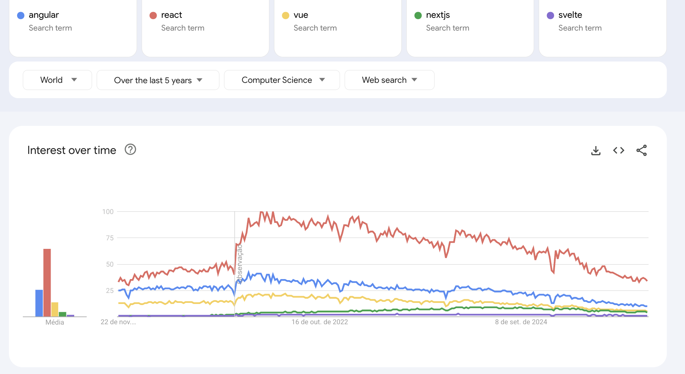
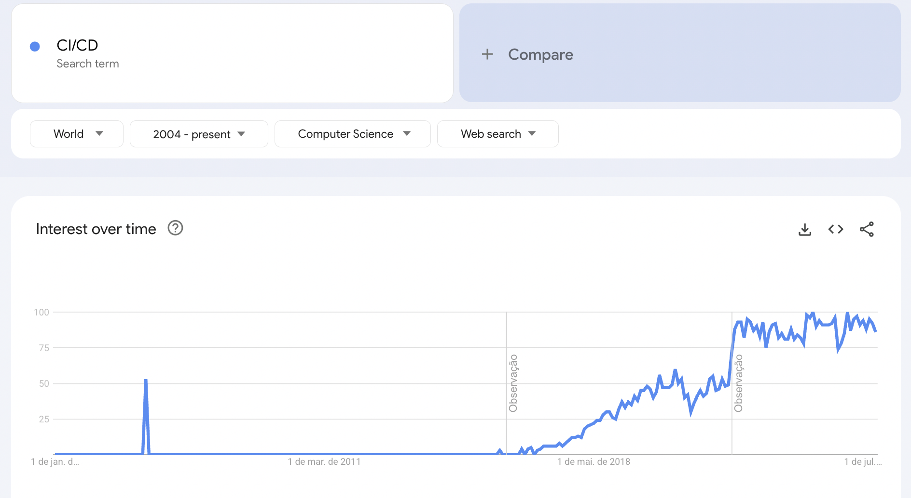

# State of React in 2025

The year is coming to an end, and we're getting past the middle of the 2020s. I thought to write about the state of browser applications as the end of this year. A recap on technologies, what I've learned through the years, and a big focus on React, given it's current dominance.

Hopefully this can also serve as an orientation for some good amount of time around how to structure things, and what to look forward to in the following years.

**TL;DR**

---
React dominates the market. SSR is a trend. State management is still painful, getting a bit better. Applications more and more leverage CI/CD practices, and analytics and metrics are on a hype. Testing, feature flags, monorepos, are more common practices these days.

Repo architecture and practices seem to converge more towards a consensus with the maturity of frameworks. Hooks are still used, and functional components dominate. Corresponding ecosystem of libraries also seem to converge to a few tools for routers, fetching, forms, UI, etc.

Moving forward, react compiler is a great change for simplifying performance. United components across mobile and web also show promise.

---

## Index

1. Browser Platform
    1. Technologies
    2. SPAs and Server rendering
    3. Browser APIs
2. Javascript and Typescript
    1. Typescript as a default
3. Project lifecycle
    1. Bundlers and paradigms
    2. Building and lifecycle
        1. CI/CD as a standard
        2. Linters, Formatters
        3. Platforms
        4. Observability
4. Project structure
    1. Folders and patterns
    2. Fetching and networking
    3. Routers
    4. Forms
    5. State management
    6. UI Toolkits
    7. Testing
5. Looking forward
    1. React compiler
    2. Activity and viewTransitions
    3. React strict DOM

## 1 - Browser Platform

The boom of JS frameworks that followed the 2010s seems to have stopped a bit, with core players being settled and having regular thriving communities. Besides personal projects, I think you would be surprised to see a new classic web application project that doesn't use any of these (except of course full E2E frameworks such as Rails and .NET). 

As far as I'm aware, all big players are open-source, and we have:

- React
- Angular
- VueJS
- Svelte

AngularJS, emberJS, backbone, and other old days frameworks can still be seen, although more rarely, in legacy projects. JQuery as well, especially in JSP and old RoR projects. Vanilla JS is also seen, but more rarely.

### 1.1 - Technologies

On the browser side of frameworks, react is still the leader as we can see in the [2025 stackoverflow survey](https://survey.stackoverflow.co/2025/technology#most-popular-technologies-webframe):

Equally, comparing with google trends, we can see react with the leadership on searches:

An interesting trend is that searches for all frameworks seem to be dropping, having reached a peak around 2022, which I feel is strongly tied to the upheaval of the LLMs, changing how development is approached. (openAI's ChatGPT 3.5 being released Nov 2022)

Doing a quick search on indeed, on Nov 2025, I found around 13000 listed react jobs, while angular had 6000 and vue 1000.

Other frameworks also have their own niches. Before using react, I worked a lot with angular, which I think is a great choice for applications with complex state, given its opinionated approach to solving it with RXJS.

### 1.2 - SPAs and Server Rendering

Back in the 2000s and early 2010s, everything was server rendered. The default was to receive a request, build HTML dynamically and send it back to the user, along with a mostly globally bundled CSS and JS, that is, the same for all pages. With more complex applications, managing state and UX in this paradigm can be hard. If you've ever managed an old RoR/PHP application with multi-step forms managed with jQuery, you know the issue.

So a new trend evolved: [Single page applications](https://en.wikipedia.org/wiki/Single-page_application). Instead of rendering things on the server, the client would request and get back a bunch of HTML+CSS+JS, bundled and compressed, which was the whole application. Easier deploys, isolated browser context, etc.

On the SPA side, React has won the battles so far, being the dominating "framework". However, server-side rendering never truly got away, because it's not about replacement, but problem specifics: each solution has its own upsides and downsides. Large SPAs can have a huge bundle size, it's harder to cache REST api requests, search engines don't parse bundled apps well, and so on.

But the idea of using [JSX](https://en.wikipedia.org/wiki/JavaScript_XML) along with the react composability model, stuck around and thus [NextJS](https://nextjs.org/) and other projects were born. Nowadays NextJS is the most popular framework to do SRR using React.

On the server-side-rendering part of react, we have the following major players:

- NextJS
- Astro
- Gatsby
- Remix

In this situation though, NextJS seems to have a wide lead over other frameworks. Personally, in recent years, I haven't seen a single job position for anything other than NextJS.

On [react conf](https://react.dev/blog/2025/10/16/react-conf-2025-recap), a lot of focus was also shown on [react server components](https://react.dev/reference/rsc/server-components), which are a variation of server side rendering but with a pre-built component tree, instead of hydrated HTML. I'll discuss more of those in the last section of this article.

## 1.3 -  Browser APIs

On the Browser side, in contrast to the earlier web years, these days there's more support and standards across the board, with considerations for support in different browsers being mostly a minor concern. The days of caring for old IE versions seem to finally be over.

Chrome leads the browser market, and [Chromium](https://www.chromium.org/Home/) serves as the basis for a lot of other browsers, like [Edge](https://www.microsoft.com/pt-br/edge/?form=MA13FJ). [Safari](https://www.apple.com/br/safari/) is still very significant on the mobile for IOS, and [Firefox](https://www.firefox.com/pt-BR/) has some representation, especially across linux users.

New APIs are being used, and tend to have wide support:

- [Fetch](https://developer.mozilla.org/en-US/docs/Web/API/Fetch_API) is used in almost all HTTP request contexts. In some cases such as with [Axios](https://axios-http.com/docs/intro) XHR requests are still used. It Can be good to have a structured library for requests, and it seems one or other things are not supported by fetch, such as [upload tracking](https://gist.github.com/adinan-cenci/9fc1d9785700d58f63055bc8d02a54d0).
- CSS and selectors have evolved a lot, with recent launches including scoped selectors and layers. Grid layout is also more broadly supported. [Kevin Powell's](https://www.youtube.com/@KevinPowell/videos) channel is a great place to be up to date with the possibilities of CSS.
- IntersectionObserver, Websockets, bluetooth, and other APIs open up the possibilities of what the browser can do. [PWAs](https://whatpwacando.today/) and apps on the web are ever more powerful.

As it was the trend in the 2010s, mobile usage grows more than other platforms, and currently dominates the market.

## 2 - Javascript and Typescript

In the beginning, the internet was all static content. Eventually [Javascript](https://www.youtube.com/watch?v=lWeLaEo4pn0) was created. [ECMAScript](https://en.wikipedia.org/wiki/ECMAScript) standardized things, Javascript became the language to add dynamism to websites. I won't go into much detail here, a more detailed history can be found [here](https://deno.com/blog/history-of-javascript).

Over the past decade javascript has gone through major changes, and is now a mature language, with a well defined scope. [ES5](https://www.w3schools.com/js/js_es5.asp) and [ES6](https://www.w3schools.com/js/js_es6.asp) were the largest changes to the language, and are now supported by all major browsers. Updates are still done annually, as with [ES2025](https://www.w3schools.com/js/js_2025.asp), but changes are very minor. [Babel](https://babeljs.io/) is still going on an in use, however these days I'd say the major task is compiling for frameworks such as react, for example transpiling JSX. Transpilation to earlier JS versions is still done, but major browsers [support recent versions](https://caniuse.com/?search=es20) of the ecmascript standard.

With untyped languages, as the project grows things can become quite messy. Hard to know what goes where, how and when. Microsoft created [Typescript](https://www.typescriptlang.org/why-create-typescript/) back in 2012 to solve this problem. Nowadays it's the standard for new projects, and recently even became supported natively by [Node](https://nodejs.org/en/learn/typescript/run-natively), even if it's just syntactic for pre-transpiling to javascript, it's a mark.

### 2.1 - Typescript as a default

Most fresh production grade projects on the javascript ecosystem use typescript by default. Support has advanced a lot, actively maintained libraries (especially in the framework context) have wide support for typescript, often being the default option.

Typescript is consolidating more and more its position as the language for browser apps, but javascript is still used, especially in legacy projects. If you're building a new project, something other than a simple script, I'd strongly suggest to simply use typescript. Surrounding tools and usage are on a good state, and unless you're gonna write it once and never touch it (which never happens), the benefits of the typing system will greatly increase maintainability.

## 3 - Project Structure

Setting up the context in the previous sections, we can see that:

- React is currently the dominating "framework"
- Typescript is the default for new projects

With this, I'll approach on this section on the state of React SPAs.

**__NOTE:__** 

---
So far the words 'react' and 'framework' have been used with quotes, and this is a sensitive topic: 
- Overall, by most people, react is viewed and nominated as a library (as the [frontpage](https://react.dev/) shows), the argument is that it's a collection of libraries to give reactivity to applications, a tool. This was the idea back when it was created.
- In recent years though, as the 'library' grew, it started to adopt more things to determine its usage, such as hooks.
- To all intents and purposes, its competitors are frameworks, and the usual "way" of building applications with this library are more or less well defined (hooks, routers, etc), although not always enforced by the library. So for the intents of this article if it [quacks like a framework](https://en.wikipedia.org/wiki/Duck_test) it's a framework.

---

### 3.1 - Bundlers and paradigm

With complex applications, there has always been an interest to use different syntax, custom parsing and other things to simplify development and that give the unique feeling of developing that given system (for example JSX with react). Multiple files arise, transpilation and other problems.

NodeJS was released back in 2009, npm in 2010. There was a wish to use this growing package system to leverage existing libraries. However, there were some problems with platform compatibility and correctly building the dependency tree for the web. You would want to minify, remove conflicts, use latest javascript standards and so on.

Thus bundlers were born. [webpack](https://www.npmjs.com/package/webpack) dominated the market up until recent years, and it's still widely adopted for other frameworks and legacy projects. It's a good tool, but known for it's difficult syntax. I have personally seen a few job openings a few years ago which were mostly some sort of 'webpack engineer'. Someone to deal with it.

A few years ago [vite](https://www.npmjs.com/package/vite) was released, which leveraged a simpler configuration syntax, using esbuild. Nowadays it dominates the market.

All in all, at a high level, we can think of the flow of SPAs these days as:

- Some custom superset of javascript (with typescript support)
- Build tools to parse, 'bundle' the app (vite, webpack, etc)
- Final result HTML + CSS (parsed for old compatibility) + JS (parsed to old ES standards)

### 3.2 - Building and lifecycle

In the context of building and deploying to production, [CI/CD](https://en.wikipedia.org/wiki/CI/CD) practices, and the use of cloud based providers and technologies has grown in interest and usage. [Git](https://git-scm.com/) is the ever present code versioning tool, with platforms such as [github](https://github.com/) providing hosting and tools to control PRs, branching, build versions, etc. With continous delivery getting more attention, [trunk based development](https://trunkbaseddevelopment.com/) being one of the common deployment practices I've used.

As for hosting, what you have these days is basically a [CDN](https://en.wikipedia.org/wiki/Content_delivery_network) for caching and faster geographical loadings and a [Load Balancer](https://en.wikipedia.org/wiki/Load_balancing_(computing)) acting as a static file server. On the self-managed side, NGINX is still widely adopted, but other options such as [traeffik](https://traefik.io/traefik) and [caddy](https://caddyserver.com/) are also promising. 

On the "semi" managed side, for example using cloud providers such as AWS, GCP or Azure, you usually have the CDN + Routing layer as a service (cloudfront, cloudflare, etc). On the "just code" side (not sure what to call here) you still have Heroku, Netlify and others, with these you just push your commits and should be good to go.

#### 3.2.1 - CI/CD as a standard

As mentioned before, when deploying to prod the practices of CI/CD seem to have become a more widely adopted standard, especially with the simplification of building, testing and other processes through tools such as [Jenkins](https://www.jenkins.io/), [GHA](https://github.com/features/actions) and [CircleCI](https://circleci.com/).

(Not sure what's that spike back on 2006....)

These CI tools provide helper modules to make build steps easier, as well as safe ways to manage secrets and authorization.

On the build pipeline itself, projects may vary, but it's often considered good to have at least:

- Linting and formatting / Static analysis
- Unit testing
- E2E testing

Optionally, depending on the project you may also have some vulnerability checks, performance checks (ex. lighthouse), etc. As excellence practices, [feature flags](https://martinfowler.com/articles/feature-toggles.html), [canary deployments](https://docs.gitlab.com/user/project/canary_deployments/) and multiple testing environments are also applied.

On the self-managed side, I've personally been using a webhook based workflow along with VPN for access control, which I think aliles well practicity with security.

#### 3.2.2 - Linters, Formatters

As mentioned before, Linters and formatters are usually part of almost any project these days. [Prettier](https://prettier.io/) and [ESLint](https://eslint.org/) are the dominating tools. Personally I've never seen anything else being used in a Typescript/Javascript project. Compared to a few years ago, configurations seem heavily simplified, with defaults usually being a great choice in most cases.

#### 3.2.3 - Platforms

Currently cloud based solutions dominate the market, with self-managed projects usually being more punctual or gated to specific constraints (security, cost). Firebase, netlify and others are used to provide full BE/FE format simplifiers. In some situations it's possible to build full E2E applications using NextJS, for example.

Also with the boom of [LLMs](https://en.wikipedia.org/wiki/Large_language_model), code generation has seen a revolution. React being the most widely adopted framework, with most content / documentation on the web, it is usually the primary tool used to generate some of those apps, unless explicitly told to use something else. Lowcode is on a hype, with companies such as Lovable and appsmith providing services.

AI (under the guise of LLMs ) is the most commented and influential technology of the past 3 years, and it has had a huge impact on how applications are built. This is not the focus of the article, so I won't delve into this. There are tons of resources out there commenting on AI, and I think it's too cloudy yet to tell what influence will come out of it for the next 10 years. The scenario is compared a lot to the dotcom bubble, and the billion dolars question is what will be the amazon's, google, microsoft, facebook, etc when the dust settles.

#### 3.2.4 - Observability

Over the last few years, in particular after the COVID pandemic, application observability also seems to have gained a lot of attention, becoming more and more the norm, applied to any application. Analytics for business development, and metrics for application performance are the captured metrics, with tools such as [newrelic](https://newrelic.com/), [grafana](https://grafana.com/), [datadog](https://www.datadoghq.com/), [segment](https://segment.com/) and many others.

It's possible to get insight into user experiences and errors, which browser is being used, what errors were triggered. Application uptime and performance are tracked with high standards. [SLOs](https://newrelic.com/blog/best-practices/what-are-slos-slis-slas), SLIs, and SLAs are related acronyms. Oncall rotations (even for non-critical applications such as banking, aviation, etc) have become the norm after the pandemics.

In this context, from the SPAs perspective, it's just a matter of connecting the correct providers on the code. 'Importing' and instantiating the library.

## 4 - Project Structure

Going back to code (phew). Projects are versioned with git, and NPM is still the dominating package manager (although yarn, pnpm are also common). In an irony of destiny, going back to the root of full E2E projects, [monorepos](https://en.wikipedia.org/wiki/Monorepo) seem to have emerged and gained some traction on the browser project side. With large projects, and libraries, tools such as [nx](https://nx.dev/) are used to separate between distinct 'deployment' units, and fine-grain control of versioning. 

Personally I've applied nx to a few [microfrontend](https://micro-frontends.org/) projects, and it can streamline the maintenance experience.

### 4.1 - Folders and patterns

As units within a 'deploy' unit, or an application, usually patterns and folders are not enforced. [nextjs](https://nextjs.org/) is an exception. Normally things are separated by concern, and dependencies in javascript tend to be quite straight forward. Class components are no longer used, except in rare exceptions (such as a global error handler or as its usually called an *error boundary*).

With this, usually in a project you'll see something like:

- Root (configs, eslint, etc)
- CI/CD scripts (usually yml formats or json)
- src
    - Components (the bread and butter, .tsx files, functional)
    - API / network calls
    - Assets
    - Hooks (Connectors to do side effects, perform async operations)
    - Providers (useContext utilities, to provide different state values)
    - Models (Typescript models)
    - Utils (varied, usually business logic layer)
- Tests

### 4.2 - Networking and fetching

As mentioned before, javascript standards are more well organized. The [fetch](https://developer.mozilla.org/en-US/docs/Web/API/Fetch_API) API suits well most cases. Sometimes libraries such as [axios](https://axios-http.com/docs/intro) are still used.

Given the inception of functional components, and hooks (in 2019), managing async state in react is still quite a pain in the ass. To 'simplify' some things libraries such as react query see a lot of adoption these days. Now, if it will stick around for the next few years it's another story, but it shows promise.

### 4.3 - Routers

If your application spans multiple pages, it's a good idea to use a routing library to standardize the way you pass parameters, render providers, do authentication, etc.

The main library in use is still [react router](https://reactrouter.com/), which is updated often and has good documentation. Recently though, with the advent of [tanstack](https://tanstack.com/), which has taken the ecosystem by storm on the fetching side, it is also used for [routing](https://tanstack.com/router/latest). It's also well maintained, but still a bit fresh. Shows promise though.

### 4.4 - Forms

Over the past few years, react hook form (released 2019) seems to be the best way to handle forms in react. Since the pandemics, personally I've never even seen anything but it being used. [NPM download metrics](https://api.npmjs.org/downloads/point/last-year/react-hook-form,formik) seem to align with this dominance.

It has a good wrapper api for custom inputs, and usually has good support with existing UI libraries (like MUI). In simple situations, a raw approach controlling with react state tools can be used, although for complex forms (and large components) the library is a must to keep good performance and simplicity.

### 4.5 - State management

Redux was and is still [used a lot](https://api.npmjs.org/downloads/point/last-year/redux,zustand,jotai,atom). I'd say the fever around using it in any context has passed, and now the overall 'feeling' is that it should be used only in [specific scenarios](https://medium.com/@dan_abramov/you-might-not-need-redux-be46360cf367) (such as replicable flows).

The React framework has evolved, and provided tools such as the [Context API](https://react.dev/reference/react/createContext) which solves a lot of issues that came before with prop drilling, and I'd for most simple CRUD based applications, with infrequent repaints it solves problems neatly.New libraries like zustand and jotai are also trending, and have proposals to solve shared state which can be interesting depending on the situation. Personally I've used atom, and seemed interesting.

This is still a fresh and highly changing field. As mentioned before, state management (especially async) is not very straight forward in react (what an irony, since the name is *react*). The initial reactivity library has far evolved beyond its initial conception, and is now becoming a true framework, which can be a challenge. In composability react goes unbeaten, in other things not so much.

There's some promise though, for example the release of the react compiler, which should simplify building performant applications, as well as other additions to make side effects (in react called effects) easier to deal with.

### 4.6 - UI Toolkits

For complex components, with custom styles, [MUI](https://www.npmjs.com/package/@mui/material) is the leading library. There are other libraries such as ChakraUI and Shadcn, but MUI dominates the area, and is overall the one with the most support. For example, it's easy to integrate its components with react-hook-form.

On the custom styling of components, the [styled components](https://www.npmjs.com/package/styled-components) approach is still widely used (I have also seen [emotion](https://www.npmjs.com/package/@emotion/react) used for that).

I'd say the biggest breakthrough in this area in recent years is the release of [Tailwind](https://www.npmjs.com/package/tailwindcss), a utility library which integrates easily, has excellent base classes and is easy to customize. A breath of fresh air from the bootstrap days.

### 4.7 - Testing

On the testing side, [jest](https://www.npmjs.com/package/jest) is still the ever present testing framework for javascript projects. After the inception of vite, [vitest](https://www.npmjs.com/package/vitest) came along shortly after, and provides a good alternative that's jest compatible but plugins to vite projects a bit easier.

[React testing lib](https://www.npmjs.com/package/@testing-library/react) is the utilities library to render components and hooks easier, and creating a user or firing user events through the [lib API](https://testing-library.com/docs/user-event/intro/) is the common way of handling interaction.

I'd say the overall approach to testing has not changed too much comparing to a few years ago, besides the fact that tests are more present in projects (with improvements to the testing lib).

## 5 - Looking forward

2025 in particular seems to have been a year of good promise for react. The biggest announcement being the react compiler, which promises to help a lot making applications performant without cryptic syntax.

### 5.1 - React compiler

After the creation of hooks, there was a necessity to have finer grained control of rendering. Each extra render is performance lost with no user benefit. On smaller apps (or with less events), it doesn't matter, but as events or the app grow, minor repaints begin to accumulate, and problems arise.

React provides some APIs to help with this: useMemo, useCallback and Memo. However, using them optimally and correctly presents a problem by itself. To the point where on most situations, people would recommend avoiding them at all, given the complexity tax.

Finally the [react compiler](https://www.npmjs.com/package/babel-plugin-react-compiler) has been released to deal with this. Basically it will act as a pre-compiler which will read the code and apply these optimizations where needed. This is very recent, first stable release being published on october 2025.

### 5.2 - Activity, viewTransitions and APIs

Recently, the react team has also been releasing some smaller APIs, with the intent of simplifying things. Among these is the [Activity](https://react.dev/reference/react/Activity) component. Basically a hide/show that is still in the react tree, so it does not get unmounted, as per the documentation, *background activity*.

[ViewTransition](https://react.dev/reference/react/ViewTransition) is also an interesting addition to simplify animations on mount/unmounts. Some 'older' additions:

- Suspense (used for async values fallback)
- use (allows easier promise data control, used with Suspense)

### 5.3 - React strict DOM and shared apps

Another interesting announcement is the release of the [react strict dom](https://github.com/facebook/react-strict-dom). Basically a unified library to use components across the web and react native, and also use CSS on mobile.

As a primary web developer, this is a long overdue feature. Personally I would love to see projects with good performance and simple code sharing. True one codebase for multiple platforms.

## Conclusion

React seems to have evolved a lot from it's class based syntax back when I started coding. There seems to be a trend towards consolidation, so I think over the next 5 years we should see things getting more unified, with a more defined way to do things. Hopefully state will be simpler to manage.

Also, goes unsaid, but take in mind that this is heavily based on my opinion and experience. I've done some research, and some things have data to back them up, for example at the project structure section, I based the most used metric on npm downloads, which I think doesn't give an unquestionable precision, but it's strongly correlated. Still, a lot is based purely on experience. If I haven't mentioned a tool, practice or idea you consider important, send me a message and I'd be happy to chat and append info to this article. More than anything I hope this can be used as a north star as to the state of things, showing a bit on how to do things (which hopefully should expire in under a few years, surpassed by simpler practices) and how things were (which should be timeless).

## Footnotes

This text took some good time to write. The largest one I've done. I'm satisfied with the results, I hope to follow along with a medium-sized application to represent this state of things. Also, I have used AI very sparingly to write this text. Some grammar checking and double checking on the project structure topics, but that's it. 

Does this sound AI written? You're absolutely wrong. Thanks.

## References

---
https://devblogs.microsoft.com/typescript/typescript-native-port/

https://survey.stackoverflow.co/2025/technology#most-popular-technologies-webframe

https://www.w3schools.com/browsers/

https://blog.jetbrains.com/webstorm/2024/02/js-and-ts-trends-2024/

https://gs.statcounter.com/

https://www.youtube.com/watch?v=8pDqJVdNa44

https://api.npmjs.org/downloads/point/last-year/<library>

https://www.indeed.com/jobs?q=react

https://www.indeed.com/jobs?q=vue

https://www.indeed.com/jobs?q=angular

---